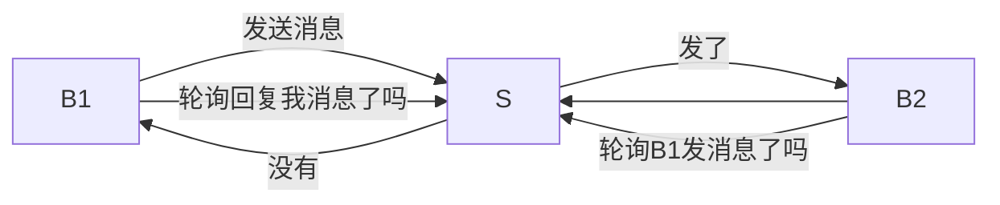
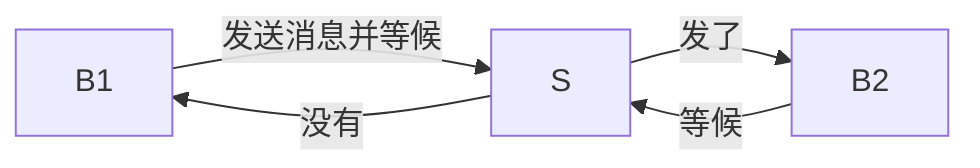

1.什么是协议
协议是约定， ### 2.什么是http协议
http协议定义Web客户端如何从Web服务器请求Web页面，以及服务器如何把Web页面传送给客户端。
http是一种不保存状态,即无状态(stateless)协议。
http基于 请求-响应 的模式 ### 3.http协议的三个规则 a.浏览器主动向服务器发出请求 b.一次请求必然对应一次响应 c.响应时间是服务器决定的
4.请求方式 GET/POST/PUT/DETELE
5.三次握手
6.http状态码
状态代码的第一个数字代表当前响应的类型： 1（信息性状态码）——请求已被服务器接收，继续处理 2（成功的状态码）——请求已成功被服务器接收、理解、并接受 3（重定向状态码）——需要后续操作才能完成这一请求 4（客户端的错误）——请求含有词法错误或者无法被执行 5（服务器的错误）——服务器在处理某个正确请求时发生错误

7.跨域
是由浏览器同源策略限制的一类请求场景。

什么是同源策略？
同源策略/SOP（Same origin policy）是一种约定，它是浏览器最核心也最基本的安全功能，如果缺少了同源策略，浏览器很容易受到XSS、CSFR等攻击。所谓同源是指"协议+域名+端口"三者相同，即便两个不同的域名指向同一个ip地址，也非同源。

怎么解决跨越
a.通过jsonp跨域 b.跨域资源共享（CORS） c.反向代理
### 1.什么是BS

    浏览器/服务器模式
    优点：分布性强 维护性强
    缺点：安全性差

### 2.什么是网络协议
    所有的数据（信号）基于协议传输的 

层 | 什么意思
---|---
应用层 | HTTP HTTPS FTP DNS 
传输层 | 标识数据该传到哪里 TCP/IP
网络层 | 路由 运送数据
连接层 | 以帧（一堆010101001010）为单位进行传输
物理层 | 物理媒介 接收信号 转译成010101010序列

### 3.什么是HTTP协议
* 什么是HTTP？

    超文本传输协议，规定了浏览器和服务器之间如何通信

* HTTP协议有哪些特点（规则）

    1. 浏览器主动向服务器发送请求
    2. 一次请求必对一次响应
    3. 响应时间不固定，但一定会响应

* 轮询 和 长连接 

    1. 轮询：不及时

    2. 长连接：占CPU
    

* ws协议 

    规定了服务器可以主动向浏览器发消息 （实时聊天）

* 三次握手和四次挥手

* HTTP的请求协议和响应协议
* HTTP的状态码
* HTTP的请求方法
* GET和POST区别
* HTTP的通信过程（工作原理）
* HTTP的缓存机制
* 跨域

